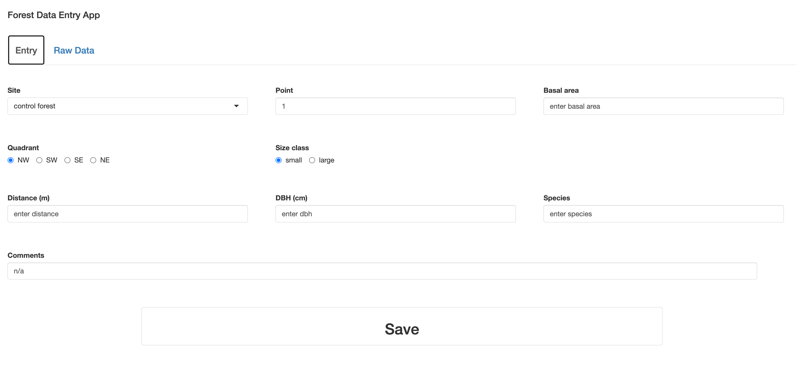
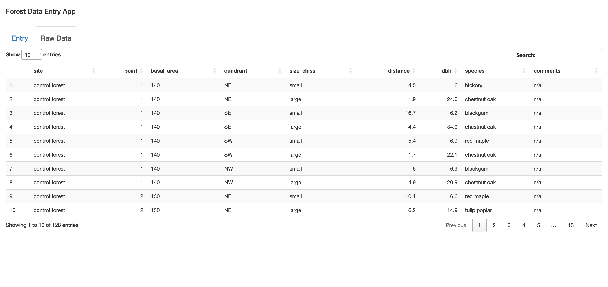

```{r setup, include=FALSE}
knitr::opts_chunk$set(eval=TRUE, echo=FALSE, message=FALSE)
library(flexdashboard)
library(ggplot2)
library(dplyr)
library(knitr)
library(tidyverse)
```

################################################################################
# About

## Left column {data-width=60}

###

```{r text, }
valueBox("Comparing forest composition at 3 sites")
```

###

```{r map, }
library(leaflet)

#different flavors of maps

#leaflet() %>% 
#  addTiles() %>% 

#leaflet() %>% 
#  addProviderTiles(providers$Esri.WorldImagery)

#leaflet() %>% 
#  addProviderTiles(providers$Esri.WorldTopoMap)

#sewanee <- data.frame(longitude = -85.9211,
#                      latitude = 35.2031)
#leaflet() %>% 
#  addTiles() %>% 
#  addCircleMarkers(data = sewanee,
#             color = "purple",
#             radius = 30,
#             popup = "Heyyyyyy!")

url <- "https://docs.google.com/spreadsheets/d/1ePc7Q0UzJ_5zfBxJCJ0ezTBWcowVLxTHBlfX8m4cWQg/edit?usp=sharing"

library(gsheet)
locs <- gsheet2tbl(url)
locs

leaflet() %>% 
  addTiles() %>% 
  addCircleMarkers(data = locs,
             color = locs$marker_color,
             radius = locs$marker_size,
             popup = paste0(locs$location))
```

## Right column {data-width=40}

###

```{r data +prep, }
tree_data <- read_csv("tree_data.csv")
tree_data %>% 
  select(-9) %>% 
  kable
```

################################################################################
# Data Entry

This is the my data collection app that I made in R. It includes all of that the analyst is recording at each site. I also added a panel to see the raw data as it is being inputed. 

## 

###

{width="100%"}

###

{width="100%"}

################################################################################
# Results

## Left column

###

Control site with no recent structures or development. 

```{r control comp, }
control_data <- tree_data %>% 
  filter(site == "control forest")
control_table <- control_data %>% 
  count(species)

ggplot(control_table,
       aes(x = species,
           y = n,
           fill = species))+
  geom_col()+
  theme_bw()+
  theme(axis.text.x = element_text(angle = -30, hjust = 0))+
  labs(title = "Control Forest Composition")
```

## Middle column

###

Site of an old dump, more recently in operation. Used for different types of waste: glass, cans, a car, radioactive waste. 

```{r brkf comp, }
brkd_data <- tree_data %>% 
    filter(site == "breakfield dump")
brkd_table <- brkd_data %>% 
  count(species)

ggplot(brkd_table,
       aes(x = species,
           y = n,
           fill = species))+
  geom_col()+
  theme_bw()+
  theme(axis.text.x = element_text(angle = -30, hjust = 0))+
  labs(title = "Breakfield Dump Forest Composition")
```

## Right column

### 

Site of another old dump. Used for longer and by more departments/facilities. Waste included household debris (broken plates and cups), medical waste, and chemistry bottles and supplies from the chem department. 

```{r oss comp, }
OSS_data <- tree_data %>% 
    filter(site == "OSS dump")
OSS_table <- OSS_data %>% 
  count(species)

ggplot(OSS_table,
       aes(x = species,
           y = n,
           fill = species))+
  geom_col()+
  theme_bw()+
  theme(axis.text.x = element_text(angle = -30, hjust = 0))+
  labs(title = "OSS Dump Forest Composition")
```
